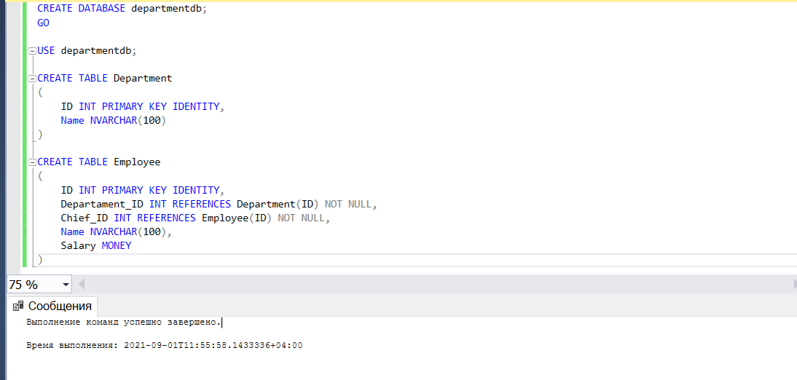
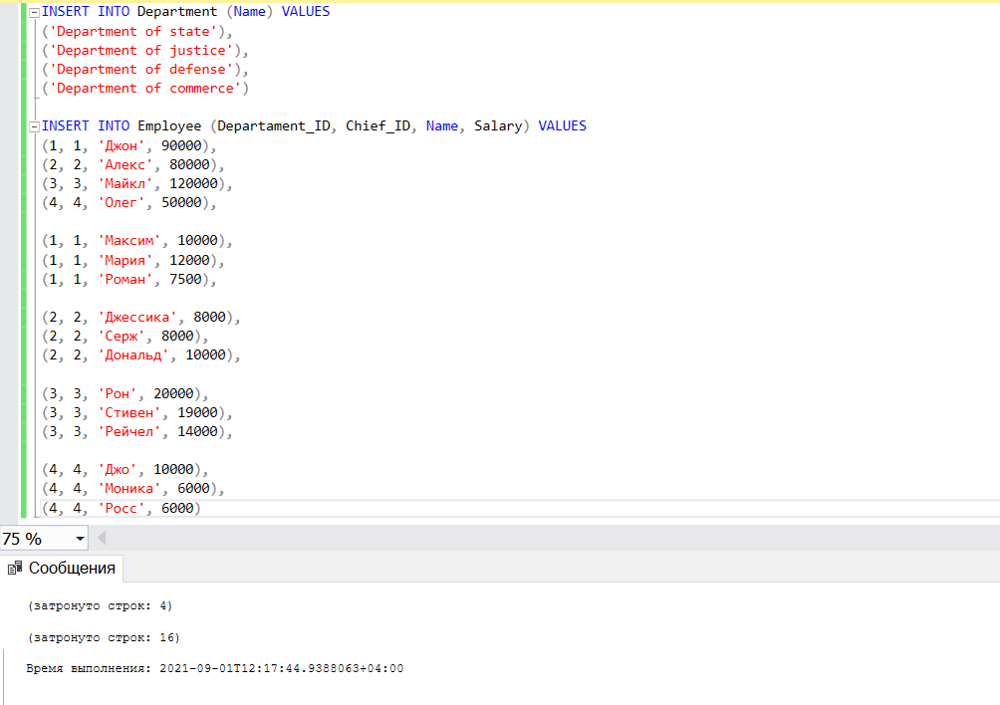
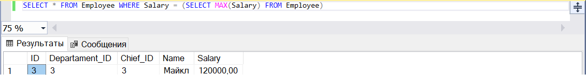
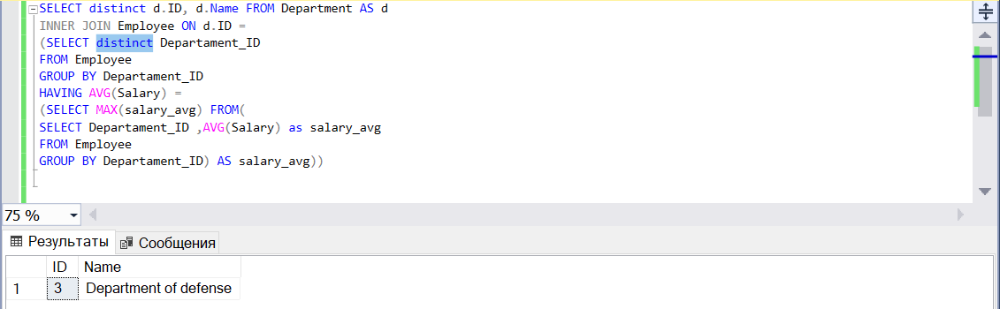
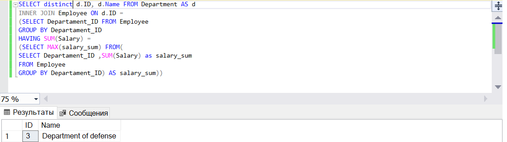
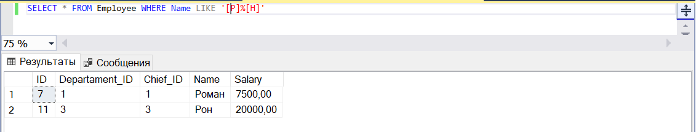

# __Задание 1__

Дана БД, имеющая две таблицы: сотрудники и подразделение.
Необходимо написать 5 запросов.

1. Сотрудника с максимальной заработной платой.
2. Отдел, с самой высокой заработной платой между сотрудниками.
3. Отдел, с максимальной суммарной зарплатой сотрудников.
4. Сотрудника, чье имя начинается на «Р» и заканчивается на «н».

***

### Пример работы программы

