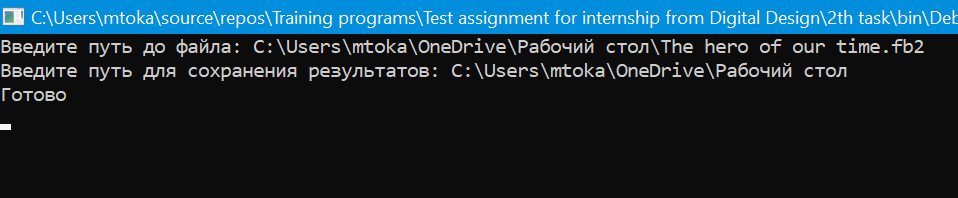
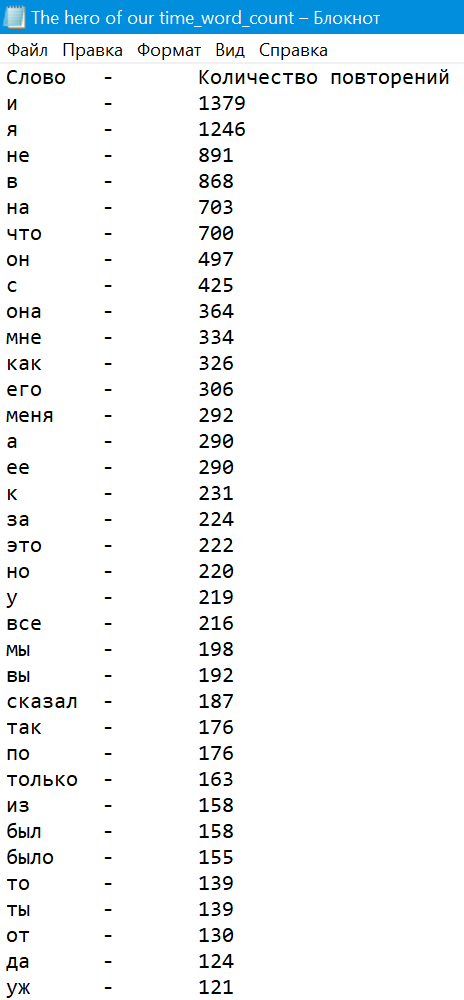

# __Задание 2__

Напишите консольное приложение на C#, которое на вход принимает большой текстовый файл
(например «Война и мир», можно взять отсюда http://az.lib.ru/). На выходе создает текстовый
файл с перечислением всех уникальных слов, встречающихся в тесте, и количеством их
употреблений, отсортированный в порядке убывания количества употреблений,

> Решением стало использование словаря, так как хэш-таблицы имеют сложность О(1), что способствует мгновенному поиску ключа и последующего взаимодейсвия. 
> В качестве ключа было использовано уникальное слово, а в качестве значение - количество повторений.
> Помимо этого, файлы формата .fb2 необходимо форматировать, чтобы убрать нежелательную html разметку. 

***

### Пример работы программы

